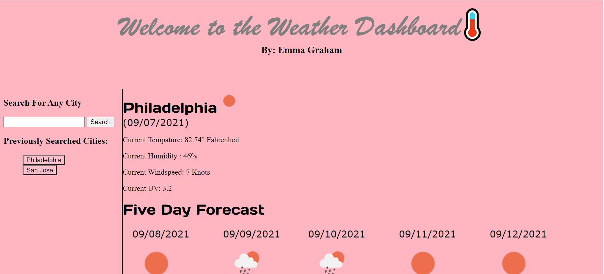
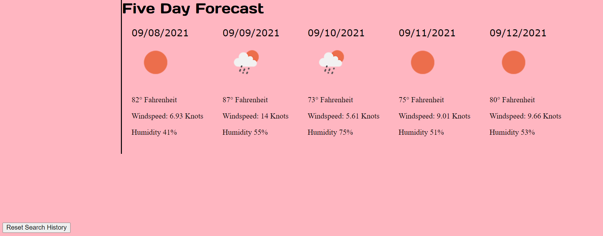

# Homework Assignment 6-Weather Dashboard

## Your Task:
This week's homework required us to create a weather dashboard application using the OpenWeather One Call API. The weather dashboard lets users input a city (or multiple cities) and retrieve a 5-day forecast. The forecast data presented includes an icon representation of weather conditions, as well as the temperature, the humidity, the wind speed, and the UV index in the selected city over the next 5 days.

## Built With:
* HTML
* CSS
* Javascript
* [Open Weather Map One Call API](https://openweathermap.org/api/one-call-api/)
* [jQuery](https://jquery.com/)
* [jQuery UI](https://jqueryui.com/)
* [Moment JS](https://momentjs.com/)
* [Bootstrap](https://getbootstrap.com/docs/5.1/getting-started/introduction/)
* [Google Fonts](https://developers.google.com/fonts/)

## Deployed Links:
* [See Live Site](https://egraham96.github.io/homework-assignment-06/)
* [Link to GitHub Repo](https://github.com/egraham96/homework-assignment-06)

## Preview of Working Site:

## Contact the Creator:
Emma Graham: https://github.com/egraham96

## License:

